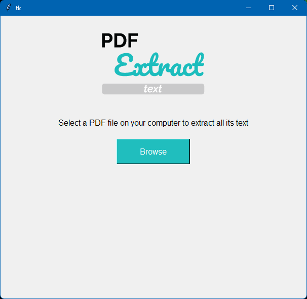
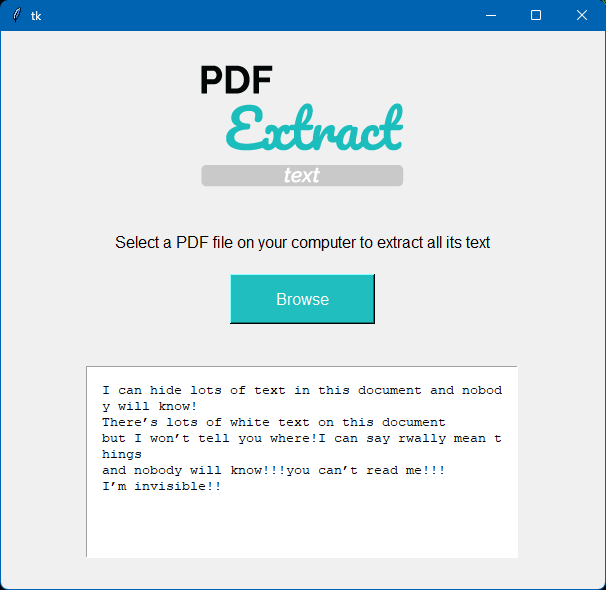

# 📄 PDF2Text

A simple Python desktop application built with **Tkinter** that allows users to select a PDF file and extract text from its first page.


## Application Preview






## Project Structure

```
PDF2Text/
│
├── assets/
│   └── logo.png
│   └── test1.pdf
│   └── test2.pdf
│   └── ui_1.png
│   └── ui_2.png
├── app.py
├── README.md
└── requirements.txt
```


## Features

- Browse and select PDF files.
- Extract text from the first page of a PDF.
- Display extracted text inside the application.
- Simple and beginner-friendly GUI built with Tkinter.


## Technologies Used

- Python 3
- Tkinter
- PyPDF2
- Pillow (PIL)


## How to Use

1. Launch the application.
2. Click the **Browse** button.
3. Select a PDF file from your computer.
4. The application extracts the text from the **first page**.
5. The extracted text is displayed in the text box.


## Current Limitations

- Extracts text only from the **first page**.
- Works only with text-based PDFs.
- Does not support scanned/image PDFs (OCR).


## Future Improvements

- Extract text from all pages.
- Save extracted text as a `.txt` file.
- Support OCR for scanned PDFs.
- Improve the UI design.
- Add drag-and-drop support.
- Display page count and file information.


## Tutorial Reference

This project was created by following the tutorial below while learning Python GUI development:

 **Link:** <https://youtu.be/itRLRfuL_PQ?si=0leKBh-uJgXLQtd8>


## 👨‍💻 Author

**Ayush Jhade**

GitHub: https://github.com/ayushjhade
